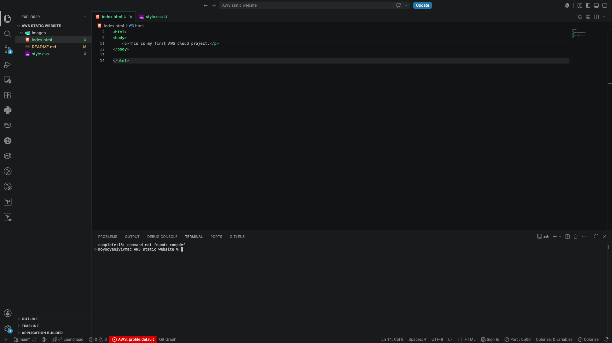
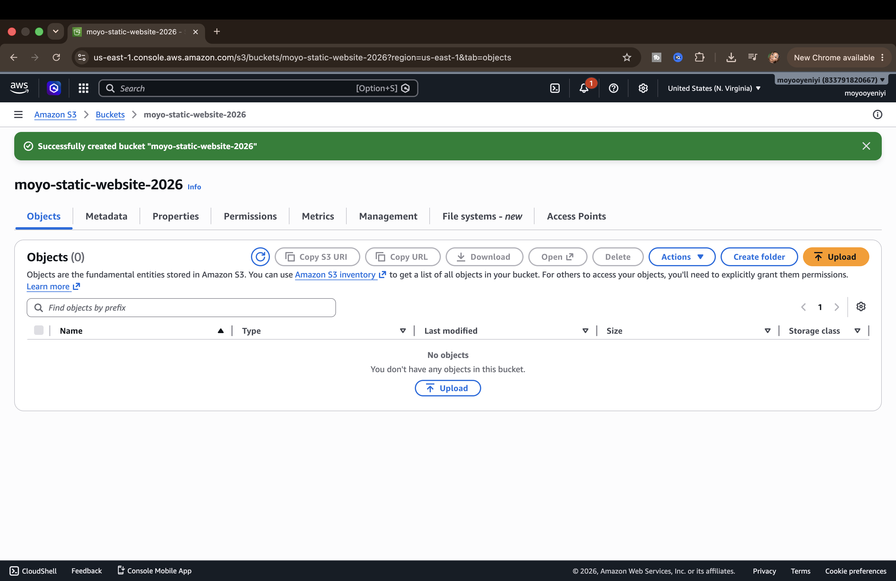
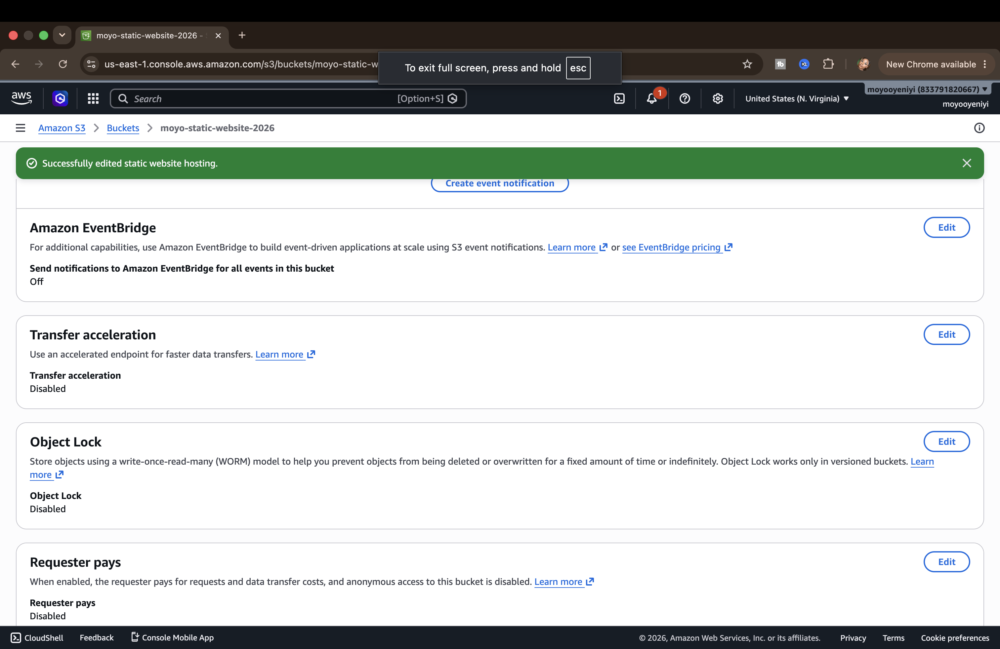
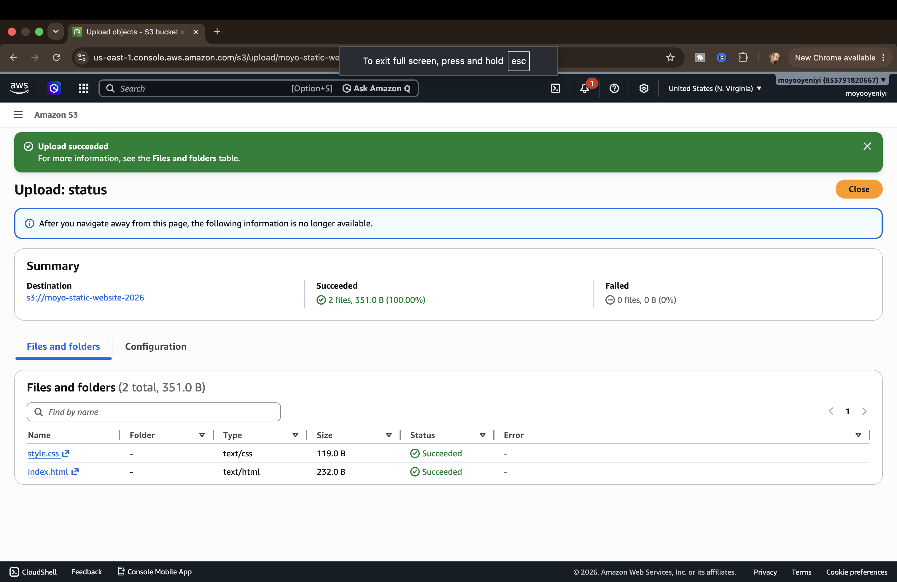
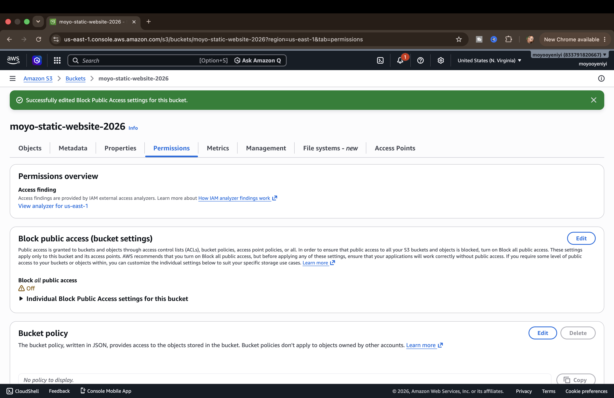
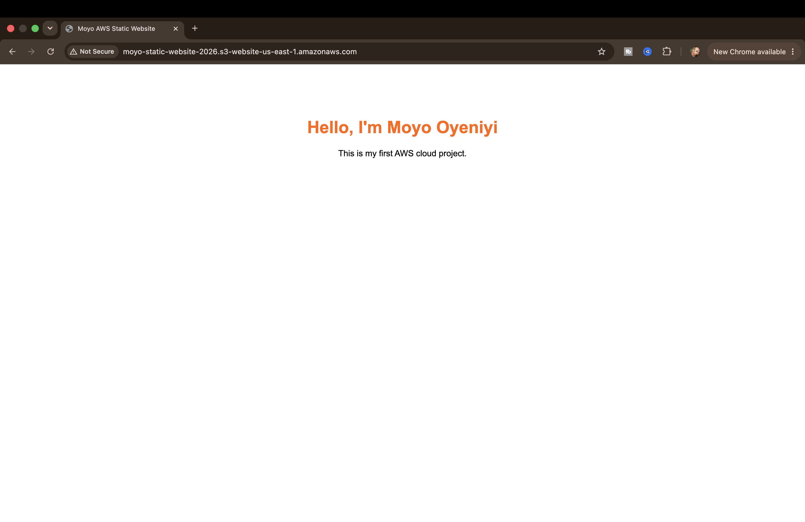
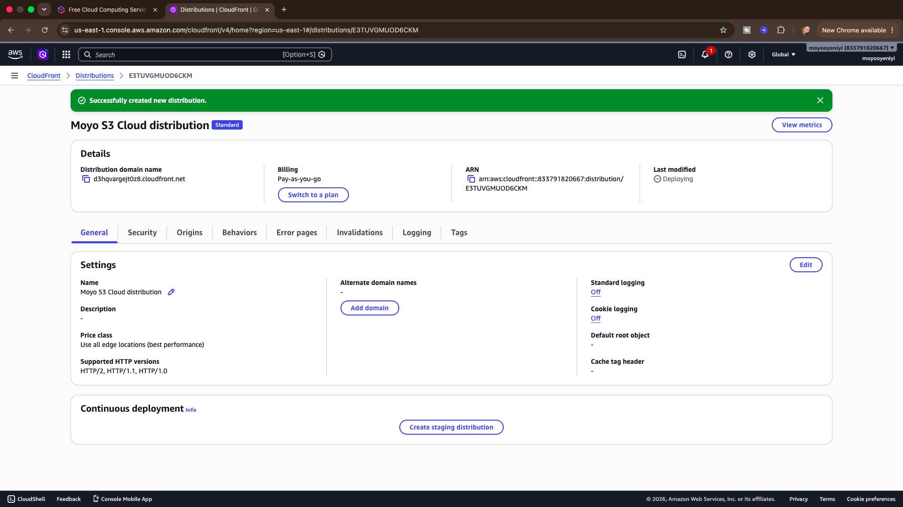
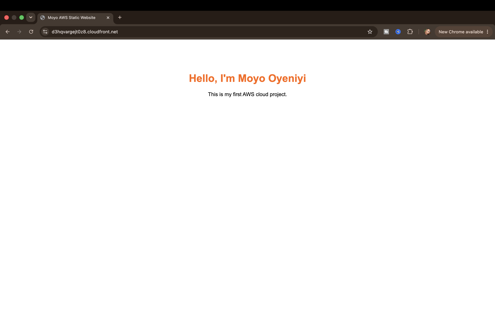
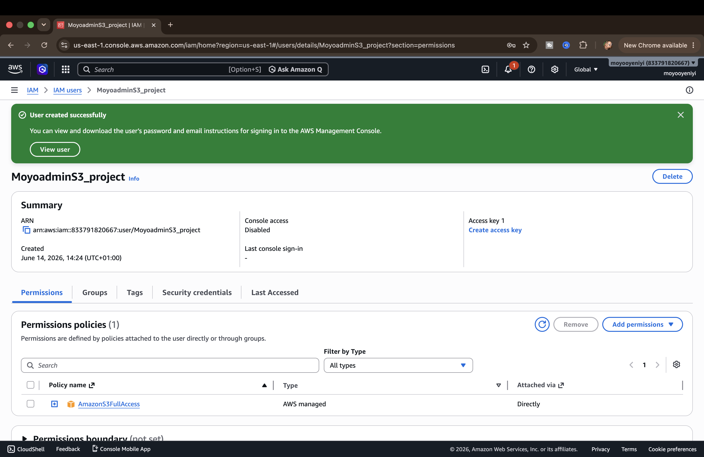

# AWS Static Website

## Project Overview

This is my first AWS cloud project.

The goal is to build and host a static website using AWS S3.

## Technologies

- HTML
- CSS
- Git
- GitHub
- AWS S3

## Progress


## Step 1: Created Website Files

This is the first version of my website running locally.




## Step 2: Created S3 Bucket

I created an Amazon S3 bucket that will host my static website.




## Step 3: Enabled Static Website Hosting

I enabled static website hosting on my S3 bucket and configured index.html as the landing page.




## Step 4: Uploaded Website Files to S3

I uploaded my website files (index.html and style.css) to my Amazon S3 bucket.

These files will be used to host the static website.




## Step 5: Enabled Public Access

To make the website accessible from the internet, I updated the S3 bucket permissions and disabled Block Public Access settings.

This allows visitors to access the website files stored in the bucket.


## Step 6: Added Bucket Policy

I configured a bucket policy to allow public read access to the objects stored in my Amazon S3 bucket.

This policy allows visitors to access the website files through the S3 website endpoint.



## Step 7: Website Live on AWS

After configuring static website hosting, public access settings, and the bucket policy, I successfully hosted my website on AWS S3.

The website is now publicly accessible through the S3 website endpoint.




## Step 8: Created CloudFront Distribution

I created an Amazon CloudFront distribution and connected it to my S3 bucket.

CloudFront acts as a Content Delivery Network (CDN), helping improve performance and providing a more production-ready architecture.



## Step 9: Website Delivered Through CloudFront

After the CloudFront distribution finished deploying, I successfully accessed my website through the CloudFront domain.

This setup improves website performance and follows AWS best practices for static website delivery.




## Step 10: Created IAM User

I created an IAM user and assigned permissions required to manage Amazon S3 resources.

This demonstrates how AWS Identity and Access Management (IAM) can be used to control access to cloud resources following security best practices.

## Security and Access Control

AWS Identity and Access Management (IAM) was used to control access to AWS resources.

IAM enables secure management of users, permissions, and policies, ensuring that only authorized users can perform actions on cloud resources.




## Architecture

```text
User
  ↓
CloudFront Distribution
  ↓
Amazon S3 Bucket
  ↓
Static Website Files


AWS Services Used

- Amazon S3
- Amazon CloudFront
- AWS IAM
- GitHub


Security and Access Control

AWS Identity and Access Management (IAM) was used to manage permissions and control access to AWS resources.

Bucket policies were configured to allow public read access to website files, while IAM provides secure access management for AWS users and administrators.


What I Learned

Through this project I learned:

- How to create and configure an S3 bucket
- How static website hosting works in AWS
- How to upload website files to S3
- How bucket policies control access to resources
- How CloudFront improves website performance
- How IAM helps secure AWS environments
- How to document cloud projects using GitHub
- Basic troubleshooting when working with AWS services


Challenges Faced

- Configuring bucket permissions correctly
- Fixing bucket policy syntax issues
- Understanding how CloudFront connects to S3
- Troubleshooting Git and GitHub repository setup


Future Improvements

- Connect a custom domain using Route 53
- Secure the website with HTTPS
- Automate deployments using GitHub Actions
- Deploy future website updates automatically
- Rebuild the infrastructure using Terraform